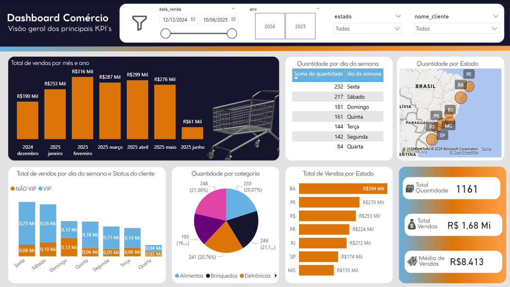

# 📊 Dashboard de Comércio em Power BI

Este projeto apresenta um dashboard interativo desenvolvido no Power BI para análise de indicadores comerciais, com foco em vendas, categorias de produtos, comportamento dos clientes e desempenho por estado.

## 🎯 Objetivo

Visualizar os principais KPIs de vendas de forma clara e estratégica, apoiando decisões com base em dados reais: total de vendas, quantidade, ticket médio, distribuição por período, categoria e região.

## 🌟 Funcionalidades

- Segmentação por ano, estado, nome do cliente e intervalo de datas
- Gráfico de barras com evolução mensal das vendas
- Gráfico de barras por dia da semana e status do cliente (VIP / Não VIP)
- Gráfico de pizza com quantidade por categoria de produto
- Gráfico de barras com quantidade por dia da semana
- Mapa interativo com quantidade por estado
- Gráfico de barras com total de vendas por estado
- Indicadores de total de vendas, quantidade total e média de vendas

## 🛠 Tecnologias

- Power BI Desktop
- DAX (Data Analysis Expressions)
- Modelagem de dados
- Visualizações interativas
- Canva (criação da tela de fundo personalizada para o dashboard)

## 📷 Preview

## 📁 Arquivo
O arquivo `.pbix` está disponível na pasta `Arquivo/`.

## 📬 Contato
Caso queira saber mais ou colaborar, entre em contato pelo [LinkedIn](https://www.linkedin.com/feed/update/urn:li:activity:7402083351383248896/)

